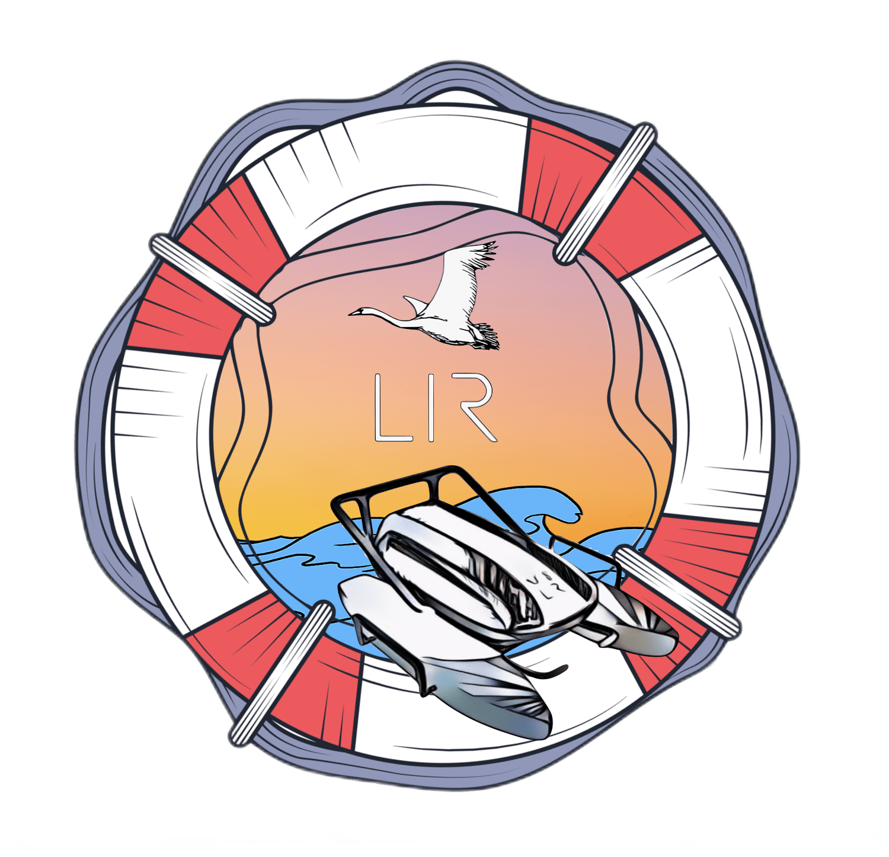

# USV LIR 2.0 Search and Rescue
  

## Overview

### This project aims to share the approach taken to build a system that combines various technologies and approaches. The final output is a real-time detection of objects in a filtered image and performing path planning for a drone boat.

<br>

## Requirements

The project is developed using Python 3.9.13 and the following libraries:

```
tkinter
tkinter.filedialog
PIL
pafy
cv2
numpy
config
networkx
roboflow

```

To install these run the command 

``` 
pip install MODULENAME
```

If you are running one of my files and you get a "module not found error" the usual fix would be to install the module with the above command.


## Color Detection:

The color detection is achieved using the mask function in OpenCV. It uses Hue, Saturation, and Value to determine a lower and upper limit for filtering a specific color. The filtered image is then shown in black and white. The image below will help with determining these values.


When running this file 1_colorDetection you should see two windows appear one being your webcam stream and the other being the filtered black and white mask.

Below you can see my example, I am filtering for blue because I am targeting water color. 


## Drawing Points:

To use motion planning in this project my idea is to divide the image into a grid of points and perform path planning. First the points need to be drawn. In the file 2_drawingPoints the following piece of code does this:

```pointGrid=[]

    for i in range(0,width,50):
        for j in range(0,height,50):
            pointGrid.append([i,j])
```

This code will create a list of points that are 50 pixels apart from each other.


These points are drawn on the image with open cv circle function. The following code does this:

```
for i in range(len(pointGrid)):
        cv2.circle(img,(pointGrid[i][0],pointGrid[i][1]), 2, (0,0,255),-1)
```

It is important to note here that I am looking to filter out anything that is not water. So I am using the mask I created in the previous step to filter out the points that are not water and only draw points on the water.

```
for i in pointGrid:
        if(mask[i[1],i[0]].sum()>0):
            valid_circles.append((i[0],i[1]))
            cv2.circle(img, (i[0],i[1]), 10, (0,0,255), 2)
```

The image below shows the points being drawn on the water.


## Object Detection:

Thanks to a platform called Roboflow [LINK ] training object detection models has been made easy. Check out their platform that allows you to annotate images, train models and deploy them quick and easy. You can quickly test your model in browser and look at evaluations of your model. RoboFlow provides a python API that allows you to use their models in your own projects. That is what I am doing here. 

When you run this file 3_objectDetection you should see a window appear with your webcam stream and the model detecting objects in real time. You will first need to enter your api key and model id. You can find these in your roboflow account or in your project tab in roboflow when you click on the model you want to use and deploy. Here is the set up in my code: 

```
from roboflow import Roboflow
rf = Roboflow(api_key=config.apiKeyPaper)
project = rf.workspace().project("usvlirpaper")
model = project.version(1).model
```

The predictions made by your model will be returned as a json onject and can be accessed like this:

```
prediction=model.predict(img, confidence=40, overlap=30).json()
```

It will be an array of objects that look like this:

```
{
    "class_id": 1,
    "name": "person",
    "relative_coordinates": {
      "center_x": 0.5,
      "center_y": 0.5,
      "width": 0.5,
      "height": 0.5
    },
    "confidence": 0.9999999999999999
  }
``` 

To draw the bounding boxes around the objects detected I used the following code:

```
for i in range(0,3,1):
        try:

            print(prediction['predictions'][i]['class'])


            bounding_box=prediction['predictions'][i]
            x0 = bounding_box['x'] - bounding_box['width'] / 2
            x1 = bounding_box['x'] + bounding_box['width'] / 2
            y0 = bounding_box['y'] - bounding_box['height'] / 2
            y1 = bounding_box['y'] + bounding_box['height'] / 2

            start_point = (int(x0), int(y0))
            end_point = (int(x1), int(y1))
            cv2.rectangle(img, start_point, end_point, color=(0,0,0), thickness=2)

            cv2.putText(
            img, # PIL.Image object to place text on
            bounding_box['class'],#text to place on image
            (int(x0), int(y0)+10),#location of text in pixels
            fontFace = cv2.FONT_HERSHEY_SIMPLEX, #text font
            fontScale = 0.6,#font scale
            color = (255, 255, 255),#text color in RGB
            thickness=2#thickness/"weight" of text

            )
        except:
            print("nothinf Found")
```
The aboe code will draw a rectangle around the object and write the name of the object on the image for only the first 3 objects detected.

The image below shows the bounding boxes being drawn around the objects detected.


## Path Planning:

The following script 4_motionPlanning takes the above steps and combines them to create a path planning algorithm. It is not perfect but it does work. The networkx python library is used to create a graph taking in all the points on the water. the starting and the end points need to be added to the graph and connected The points are in a grid and are connected vertically, horizontally and diagonally to each other. The following code does this:

```
 for point in valid_circles:
            G.add_node(point)

        # Add edges between nodes with weights as Euclidean distance
        for i in range(len(valid_circles)):
            for j in range(i+1, len(valid_circles)):
                
                x1, y1 = valid_circles[i]
                x2, y2 = valid_circles[j]
                # distance = sqrt((x1 - x2)**2 + (y1 - y2)**2)
                # G.add_edge(coordinate_points[i], coordinate_points[j], weight=distance)
                if (abs(x1-x2)<=75 or abs(x1-x2)==0) and (abs(y1-y2)<=75 or abs(y1-y2)==0):
                    distance = sqrt((x1 - x2)**2 + (y1 - y2)**2)
                    G.add_edge(valid_circles[i], valid_circles[j], weight=distance)

```


Next I picked Dijstras algorithm to perform the search for the shortest path. This and other algorithms I tested are in the files above. The network x library makes it easy to implement dijkstras algorithm. The following code does this:

```
  try:
            shortest_path = nx.dijkstra_path(G, startPoint, endPoint, weight='weight')

            print(shortest_path)

            for i in range(len(shortest_path)):
                if(i+1<len(shortest_path)):
                    cv2.line(img2, (shortest_path[i]), (shortest_path[i+1]), (0, 255, 0), thickness=3, lineType=8)

        except: 
            print("No path found")
```

The video below shows the path Planning in action.


[](https://www.youtube.com/watch?v=dWNm99I6LBw)


##  Path Following:


## gui.py

This is a helper python graphical user interface that will allow you to either use a webcam, local file or url to stream and process the images. It is a simple tkinter gui that allows you to select the options you want and then runs the code. 

It also has 6 Hue Saturation Value sliders that allow you to adjust the HSV values of the water. This is useful if the water is not a uniform color. 

Idea for this is to be quickly able to put in a url from a drone sream and have it process the images and send commands to the drone.