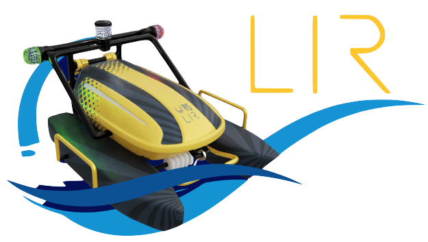

<p align='center'>
  
</p>

<h1 align='center'>
USV LIR 2.0 - Path Planning for Maritime Search and Rescue applications
</h1>
<p align='center'>
  
  
  
  <br>


  <p align='center'>Real Search and rescue version</p>
  <p align='center'>
  <a href="https://universe.roboflow.com/usvsetu/usv_lir_search_and_rescue">
      </img>
  </a>
  <a href="https://universe.roboflow.com/usvsetu/usv_lir_search_and_rescue/model/">
      </img>
  </a>
</p>
  <br>
   <p align='center'>Paper model version</p>
  <p align='center'>
  <a href="https://universe.roboflow.com/usvsetu/usv_lir_search_and_rescue">
      </img>
  </a>
  <a href="https://universe.roboflow.com/usvsetu/usv_lir_search_and_rescue/model/">
      </img>
  </a>
</p>
<br>
<p align='center'>
 | 

</p>


# Project Overview


<!-- ### USV LIR 2.0 is an unmanned surface vehicle (USV) codenamed LIR after the Irish folklore legend the Childeren of Lir. It is designed as an open research platform allowing citizen research and pimary and secondary education level research. This platform is designed with many use cases in mind, including search and rescue, environmental monitoring, and more. This project is being used as a showcase of third level engineering to primary and secondary school students throught the means of running a mission design competition. This project interested marine biologists from Catholic University of valencia and IMEDMAR Valencia Spain and they are excited for our second goal that is is a sucessful mission in Valencia harbour, Spain, where the USV is be used to autonomously perofrm one of the weekly manrine research data collecting tasks of collecting water temperature, salinity, and oxygen levels at different depths. 

### The unique thing about this project is the layers of technology located under the hood. There is the master controller called Pixhawk 3, which is a flight controller used on many autonomous drone project that controls the boat with the help of GPS. It connects to a laptop through telementary communication and a RadioLink controller is used as a master controller for manual control. QGround conrol and Mission Plannert are the two mission planing software tools used to configure the boat and make it follow waypoints. The big thing on this boat is the microbit interface. Microbits are small microprocessors that are easily programmed with virtual puzzle blocks. This feature is a unique selling point of the project and it is waht enables this to be an open research platform. This infrastructure is used to abstract the complexity, physicas and math of the boat and allow anyone with little to no computer science or engineering experience to start developing missions for the boat. 

### My focus of this project is maritime search and rescue. I am using the USV LIR 2.0 to detect people with risk of drowning in the water and perform path planning to navigate to the person. The object detection is achieved using object detecion training models with tools like tensorflow and the roboflow API and the path planning is achieved using python and the fusion of image processing methods. I also developed a simple GUI to allow the user to select the video stream they want to use, and to select the model they want to use for object detection. The GUI also has image processing functionality to a certain extent allowinf for realtime adjustements to be made to improve the path planning process. I hope that my project will be useful to others who are interested in developing similar projects and make it easier for them to get started having the basic set up at hand. -->

 The USV LIR 2.0 is an unmanned surface vehicle designed to serve as an open research platform. It is named after the Irish legend Children of Lir. This project showcases engineering to school students through a mission design competition and is being used for marine research by biologists from Catholic University of Valencia. The unique aspect of this project is the technology underneath. The master controller, Pixhawk 3, controls the boat with the help of GPS and is connected to a laptop through telemetry communication, while QGround Control is the mission planning software tool used to configure the boat. The microbit interface, a small microprocessor programmed with virtual puzzle blocks, is a standout feature that makes this platform accessible to anyone, regardless of their technical background. My primary focus is maritime search and rescue, using object detection training models and image processing methods to detect and rescue people in risk of drowning. I developed GUI to provide ease of use for future use. The path planning for the boat is done with common motion planning algorithms like Dijkstra and the communication is done through MQTT as well as the pyMavLink library allowing for communication between the pixhawk and a laptop feeding to a microbit network.


# Technologies 

 Python, tensorflow, Pixhawk, Microbit, MQTT, AWS, Roboflow, OpenCV, QGroundControl, RoboFlow, YoloV5 and more...

<br>

# Repository Overview

This is the folder structure
```
Motion Planning 
├── Initial_Steps
│   ├── 1_colorDetection.py -- color detection with opencv
│   ├── 2_contours.py -- drawing contours around a shape
│   ├── 2_drawingPoints.py -- drawing points on an image on the selected mask
│   ├── 3_objectDetection.py -- object detection with roboflow API
│   ├── 4_motion palnning.py -- simple path planning 
│   ├── 5_mqttSetup.py -- mqtt setup

├── Initial_Tests
│   ├── testingWithImage.py -- testing with images simple path planning
│   ├── testingWithVideo.py -- testing with video simple path planning

├── PathFIndingAlgo
│   ├── python_A_star.py -- A* algorithm 
│   ├── python_DijkstraNX.py -- Dijkstra algorithm

├── Utils
│   ├── pickoutimages.py -- script to pick out images from RoboFLow Export depending on the labels
│   ├── pyMavLink.py -- communication set up between pixhawk and the script, simple heartbeat and compass value 
│   ├── serialToMicrobit.py -- communication set up between microbit and labtop over serial

├── YOLO_PaperModel --folder with Yolo repo and the trained model of the bench trained paper cut out images

├── YOLO_RealModel -- folder with Yolo repo and the model trained with real images

├── Tensorflow Folders -- used early in the project not used anymore, work with windows. Object detection script (detectVideo)

├── app_gui_mqtt.py -- GUI full application with mqtt communication

├── app_gui_serial.py -- GUI full most up to date application with pyMavLink communication

├── res -- Images and videos used in the readme

```
 Understanding the whole application could be a headache thats why i tried to break down every step in the Initial steps showing simple hello world steps.
 The full application files just combine all the smaller scripts and link them all. You an find more info on the project in the report pdf file.

<br>

## Requirements

The project is developed using Python 3.9.13 and it was made on a mac, I believe it should work on a windows machine, but i have not tested it. My machine is 2020 M1 MacBook Pro.
To install the same libraries I used please run the command below in your terminal after you cloned the repo.

```
pip install -r requirements.txt
```

If you are running one of my files and you get a "module not found error" the usual fix would be to install the module with the pip install command.

<br>

## Metrics of Models

Two methds of training were used one with YOLOv5 and one with RoboFlow. Roboglow was able to handle a lot more images and a lot more epochs my machine was only trained on 300 images approx. and 70 iteratrions.

```
RoboFlow    - mAP 93.8% | precision 94.0% | recall 91.3%
```
```
YoloV5      - mAP 71.8% | precision 86.8% | recall 86.8%
```

<br>

## Youtube Tutorials and videos


[](https://www.youtube.com/watch?v=dWNm99I6LBw)


<h3>Common Errors</h3>

<details><summary> <b>Expand</b> </summary>
  <ul>
  <li> module not found error: means you dont have the library installed use pip install sometimes you might need to use homebrew if on mac</li>
  <li>youtube errors: if using youtube streams libraries could be out of date or yourube has updated something on their side</li>
  <li>Problems with color when running the GUI: a bug sometimes you might need to start the stream twice or restart </li>
  <li></li>
  </ul>
</details>

<br>

<h3>Future Developments</h3>

<details><summary> <b>Expand</b> </summary>
  <ul>
    <li>Using pyMavLink and drone kit libraties for path planning with GPS </li>
  <li>Use Gazebo Simulation tool </li>
  <li>Use LoRa or other long range network to make it possible to use without internet</li>
  <li>Use a quadcopter with a pixhawk</li>
  <li>Add more sensors to the USV</li>
  </ul>
</details>

<br>
<h3>Acknowledgement</h3>

<details><summary> <b>Expand</b> </summary>
  <ul>
    <li>
    This project wouldn't possible without amazing & free RoboFlow <a href="https://roboflow.com/annotate">annotation tools</a> , open-source <a href="https://universe.roboflow.com/">datasets</a>, quick & easy <a href="https://roboflow.com/deploy">deployement</a> and high-level <a href="https://blog.roboflow.com/">blog posts</a></li>
    <li>If you're interested in learning more about object detection and recognition, I highly recommend checking out <a href="https://www.youtube.com/watch?v=yqkISICHH-U&t=9214s"> Nicholas's course</a>  It helped me get started with machine learning.</li>
  <li>Supervisor</li>
  <li>Applied Robotics Lab Team</li>
  <li>South East Technological University</li>
  </ul>
</details>