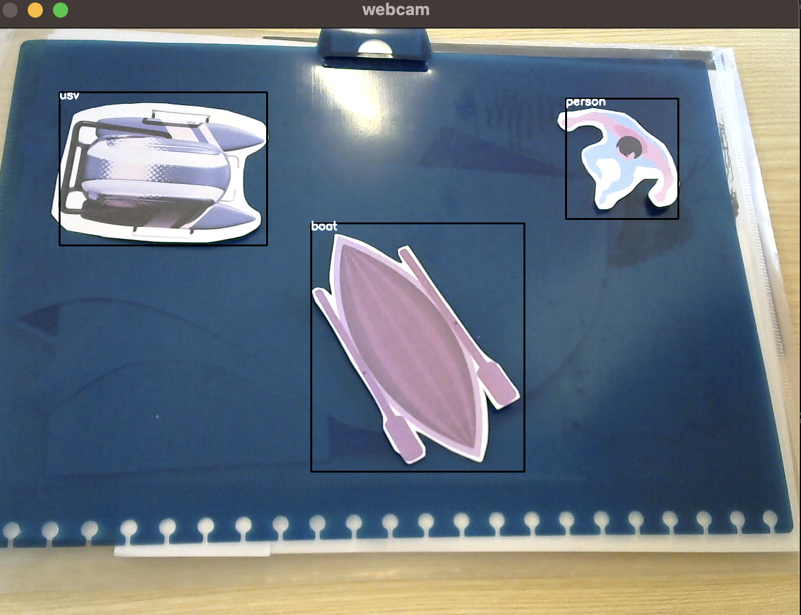

# USV LIR 2.0 - Path Planning for Maritime Search and Rescue applications


  

# Project Overview


<!-- ### USV LIR 2.0 is an unmanned surface vehicle (USV) codenamed LIR after the Irish folklore legend the Childeren of Lir. It is designed as an open research platform allowing citizen research and pimary and secondary education level research. This platform is designed with many use cases in mind, including search and rescue, environmental monitoring, and more. This project is being used as a showcase of third level engineering to primary and secondary school students throught the means of running a mission design competition. This project interested marine biologists from Catholic University of valencia and IMEDMAR Valencia Spain and they are excited for our second goal that is is a sucessful mission in Valencia harbour, Spain, where the USV is be used to autonomously perofrm one of the weekly manrine research data collecting tasks of collecting water temperature, salinity, and oxygen levels at different depths. 

### The unique thing about this project is the layers of technology located under the hood. There is the master controller called Pixhawk 3, which is a flight controller used on many autonomous drone project that controls the boat with the help of GPS. It connects to a laptop through telementary communication and a RadioLink controller is used as a master controller for manual control. QGround conrol and Mission Plannert are the two mission planing software tools used to configure the boat and make it follow waypoints. The big thing on this boat is the microbit interface. Microbits are small microprocessors that are easily programmed with virtual puzzle blocks. This feature is a unique selling point of the project and it is waht enables this to be an open research platform. This infrastructure is used to abstract the complexity, physicas and math of the boat and allow anyone with little to no computer science or engineering experience to start developing missions for the boat. 

### My focus of this project is maritime search and rescue. I am using the USV LIR 2.0 to detect people with risk of drowning in the water and perform path planning to navigate to the person. The object detection is achieved using object detecion training models with tools like tensorflow and the roboflow API and the path planning is achieved using python and the fusion of image processing methods. I also developed a simple GUI to allow the user to select the video stream they want to use, and to select the model they want to use for object detection. The GUI also has image processing functionality to a certain extent allowinf for realtime adjustements to be made to improve the path planning process. I hope that my project will be useful to others who are interested in developing similar projects and make it easier for them to get started having the basic set up at hand. -->

### The USV LIR 2.0 is an unmanned surface vehicle designed to serve as an open research platform. It is named after the Irish legend Children of Lir. This project showcases engineering to school students through a mission design competition and is being used for marine research by biologists from Catholic University of Valencia. The unique aspect of this project is the technology underneath. The master controller, Pixhawk 3, controls the boat with the help of GPS and is connected to a laptop through telemetry communication, while QGround Control is the mission planning software tool used to configure the boat. The microbit interface, a small microprocessor programmed with virtual puzzle blocks, is a standout feature that makes this platform accessible to anyone, regardless of their technical background. My primary focus is maritime search and rescue, using object detection training models and image processing methods to detect and rescue people in risk of drowning. I developed GUI to provide ease of use for future use. The path planning for the boat is done with common motion planning algorithms like Dijkstra and the communication is done through MQTT.


# Technologies 
### Python, tensorflow, Pixhawk, Microbit, MQTT, AWS, Roboflow, OpenCV, QGroundControl

# Repository Overview
### In this repository you will find two folders: MyPathPlanning folder and TFODCourseYT

<br>
<br>

## MyPathPlanning folder
#### The `MyPathPlanning` folder contains all of the code used in my project, including color detection, object detection using the roboflow API, and motion planning. I've made an effort to keep the code simple and easy to follow, so that others can reproduce the steps.

<br>
<br>

## TFODCourseYT folder
#### The `TFODCourseYT` folder contains materials from Nicholas Renotte's YouTube course on object detection and recognition. Nicholas is a well-known YouTuber in the field, and his course helped me to learn about training models from scratch, engineering them, and evaluating their performance. In this folder, you'll find some of my scripts and the models I've trained on my local machine. 

#### If you're interested in learning more about object detection and recognition, I highly recommend checking out Nicholas's course [here](Link to course).


# USV LIR 2.0 Search and Rescue
  

## Overview

### This project aims to share the approach taken to build a system that combines various technologies and approaches. The final output is a real-time detection of objects in a filtered image and performing path planning for a drone boat.

<br>

## Requirements

The project is developed using Python 3.9.13 and the following libraries:

```
tkinter
tkinter.filedialog
PIL
pafy
cv2
numpy
config
networkx
roboflow

```

To install these run the command 

``` 
pip install MODULENAME
```

If you are running one of my files and you get a "module not found error" the usual fix would be to install the module with the above command.


## Color Detection:

The color detection is achieved using the mask function in OpenCV. It uses Hue, Saturation, and Value to determine a lower and upper limit for filtering a specific color. The filtered image is then shown in black and white. The image below will help with determining these values.


When running this file 1_colorDetection you should see two windows appear one being your webcam stream and the other being the filtered black and white mask.

Below you can see my example, I am filtering for blue because I am targeting water color. 


## Drawing Points:

To use motion planning in this project my idea is to divide the image into a grid of points and perform path planning. First the points need to be drawn. In the file 2_drawingPoints the following piece of code does this:

```pointGrid=[]

    for i in range(0,width,50):
        for j in range(0,height,50):
            pointGrid.append([i,j])
```

This code will create a list of points that are 50 pixels apart from each other.


These points are drawn on the image with open cv circle function. The following code does this:

```
for i in range(len(pointGrid)):
        cv2.circle(img,(pointGrid[i][0],pointGrid[i][1]), 2, (0,0,255),-1)
```

It is important to note here that I am looking to filter out anything that is not water. So I am using the mask I created in the previous step to filter out the points that are not water and only draw points on the water.

```
for i in pointGrid:
        if(mask[i[1],i[0]].sum()>0):
            valid_circles.append((i[0],i[1]))
            cv2.circle(img, (i[0],i[1]), 10, (0,0,255), 2)
```

The image below shows the points being drawn on the water.


## Object Detection:

Thanks to a platform called Roboflow [LINK ] training object detection models has been made easy. Check out their platform that allows you to annotate images, train models and deploy them quick and easy. You can quickly test your model in browser and look at evaluations of your model. RoboFlow provides a python API that allows you to use their models in your own projects. That is what I am doing here. 

When you run this file 3_objectDetection you should see a window appear with your webcam stream and the model detecting objects in real time. You will first need to enter your api key and model id. You can find these in your roboflow account or in your project tab in roboflow when you click on the model you want to use and deploy. Here is the set up in my code: 

```
from roboflow import Roboflow
rf = Roboflow(api_key=config.apiKeyPaper)
project = rf.workspace().project("usvlirpaper")
model = project.version(1).model
```

The predictions made by your model will be returned as a json onject and can be accessed like this:

```
prediction=model.predict(img, confidence=40, overlap=30).json()
```

It will be an array of objects that look like this:

```
{
    "class_id": 1,
    "name": "person",
    "relative_coordinates": {
      "center_x": 0.5,
      "center_y": 0.5,
      "width": 0.5,
      "height": 0.5
    },
    "confidence": 0.9999999999999999
  }
``` 

To draw the bounding boxes around the objects detected I used the following code:

```
for i in range(0,3,1):
        try:

            print(prediction['predictions'][i]['class'])


            bounding_box=prediction['predictions'][i]
            x0 = bounding_box['x'] - bounding_box['width'] / 2
            x1 = bounding_box['x'] + bounding_box['width'] / 2
            y0 = bounding_box['y'] - bounding_box['height'] / 2
            y1 = bounding_box['y'] + bounding_box['height'] / 2

            start_point = (int(x0), int(y0))
            end_point = (int(x1), int(y1))
            cv2.rectangle(img, start_point, end_point, color=(0,0,0), thickness=2)

            cv2.putText(
            img, # PIL.Image object to place text on
            bounding_box['class'],#text to place on image
            (int(x0), int(y0)+10),#location of text in pixels
            fontFace = cv2.FONT_HERSHEY_SIMPLEX, #text font
            fontScale = 0.6,#font scale
            color = (255, 255, 255),#text color in RGB
            thickness=2#thickness/"weight" of text

            )
        except:
            print("nothinf Found")
```
The aboe code will draw a rectangle around the object and write the name of the object on the image for only the first 3 objects detected.

The image below shows the bounding boxes being drawn around the objects detected.





## Path Planning:

The following script 4_motionPlanning takes the above steps and combines them to create a path planning algorithm. It is not perfect but it does work. The networkx python library is used to create a graph taking in all the points on the water. the starting and the end points need to be added to the graph and connected The points are in a grid and are connected vertically, horizontally and diagonally to each other. The following code does this:

```
 for point in valid_circles:
            G.add_node(point)

        # Add edges between nodes with weights as Euclidean distance
        for i in range(len(valid_circles)):
            for j in range(i+1, len(valid_circles)):
                
                x1, y1 = valid_circles[i]
                x2, y2 = valid_circles[j]
                # distance = sqrt((x1 - x2)**2 + (y1 - y2)**2)
                # G.add_edge(coordinate_points[i], coordinate_points[j], weight=distance)
                if (abs(x1-x2)<=75 or abs(x1-x2)==0) and (abs(y1-y2)<=75 or abs(y1-y2)==0):
                    distance = sqrt((x1 - x2)**2 + (y1 - y2)**2)
                    G.add_edge(valid_circles[i], valid_circles[j], weight=distance)

```


Next I picked Dijstras algorithm to perform the search for the shortest path. This and other algorithms I tested are in the files above. The network x library makes it easy to implement dijkstras algorithm. The following code does this:

```
  try:
            shortest_path = nx.dijkstra_path(G, startPoint, endPoint, weight='weight')

            print(shortest_path)

            for i in range(len(shortest_path)):
                if(i+1<len(shortest_path)):
                    cv2.line(img2, (shortest_path[i]), (shortest_path[i+1]), (0, 255, 0), thickness=3, lineType=8)

        except: 
            print("No path found")
```

The video below shows the path Planning in action.


[](https://www.youtube.com/watch?v=dWNm99I6LBw)


##  Path Following:


## gui.py

This is a helper python graphical user interface that will allow you to either use a webcam, local file or url to stream and process the images. It is a simple tkinter gui that allows you to select the options you want and then runs the code. 

It also has 6 Hue Saturation Value sliders that allow you to adjust the HSV values of the water. This is useful if the water is not a uniform color. 

Idea for this is to be quickly able to put in a url from a drone sream and have it process the images and send commands to the drone.